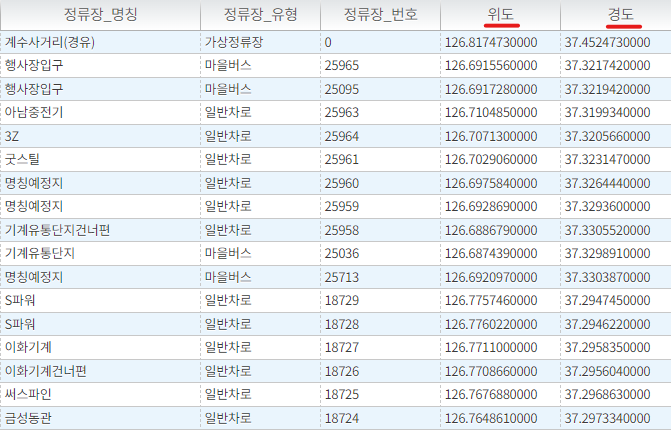
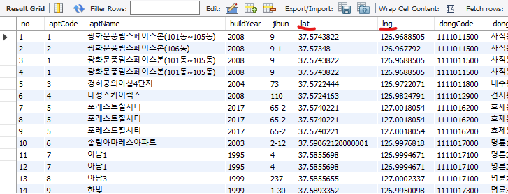
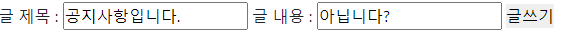
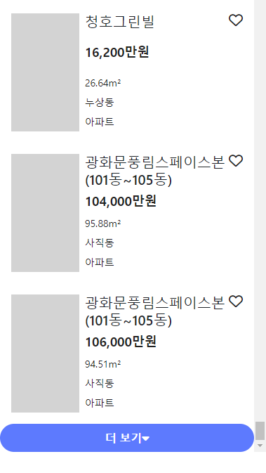

# README

# 공공 데이터를 활용한 주택거래정보 검색 사이트

## **프로젝트 개요**

- 공공 데이터를 활용한 주택거래정보 검색 사이트
- 프로젝트 제목 : Happy House Project
- 프로젝트 기간 : 2022.05.06.월
- 참여자 : 최승원, 한윤석

## **사용 기술 스택**

- Spring Boot
- HTML5
- CSS3
- JavaSript

## **개발 도구**

- Spring Tool Suite 3

# 알고리즘 기능 구현 기획서

### 선택한 거래 매물의 전방 300m 거리 안에 있는 병원 지도에 출력 기능 구현

- 병원 정보 데이터 

  - 병원 이름, 병원 소개, 전화번호, 위도, 경도 를 가지는 데이터

    

- 선택한 거래 매물의 위도, 경도와 병원들의 위도 경도 변수를 활용하여 두 지점의 거리를 구한다.

- 이 때, 사용한 거리 계산 공식

  - 두 지점의 위도 경도를 활용하여 직선 거리를 구한다. (단위 : m)

    

  

- HousedealService.java

  - 기준 거리 1000

  - 전체 병원의 목록을 가져와서 현재 매물과의 거리를 모두 구한 후 기준 거리보다 작은 거리인 병원들의 목록을 추려낸다.

    

  

- 결과 

  

### 아이디 길이 제한 및 중복 체크 기능 구현

- 아이디 입력창에 입력된 텍스트의 길이를 계산하여 아이디가 6자 미만, 16자 초과로 입력 되면 "아이디는 6자이상 16자이하입니다." 문구를 띄워준다.

  

- 아이디 길이 제한 조건을 만족했을 경우, 입력된 텍스트를 데이터베이스 User 테이블에서 해당 텍스트를 이용해 아이디를 검색한다. 일치하는 데이터가 존재할 경우. 즉, 사용 중인 아이디를 입력하면 "사용할 수 없습니다" 문구를 띄워준다. 이 때, 회원가입 버튼창은 비활성화한다. (disabled)

  

- 일치하는 데이터가 존재하지 않을 경우. 즉, 사용 가능한 아이디를 입력하면 "사용가능합니다" 문구를 띄우주고 회원가입 버튼을 활성화한다.

  

### 거래 매물 검색 기능 구현

- 검색하고 싶은 keyword를 입력 후 버튼을 누르면 검색한 keyword가 아파트 이름 또는 동이름에 포함되는 매물 결과를 출력한다. 

- SQL에서 Concat, Like를 활용하여 검색 구현

  select *
  from housedeal_main
  WHERE aptName LIKE CONCAT('%', #{word}, '%') OR dongName LIKE CONCAT('%', #{word}, '%')

- 

  

### 거래 매물 더보기 기능 구현

- 초기에 100개의 매물 결과가 출력 되고 더보기를 누를 때마다 다음 100개의 매물 결과가 추가로 출력된다.

  

  - 초기에 100개의 매물 결과가 출력 되고 더보기를 누를 때마다 다음 100개의 매물 결과가 추가로 출력된다.

    

    ​			프론트에서 시작 인덱스 정보를 PathVariable에 담아서 넘겨줍니다.

​						

​						백엔드에서는 LIMIT 쿼리문을 통해 전달받은 인덱스로부터 100개의 데이						터를 리스트로 반환해줍니다.

​	

​	  					

### 공지사항 Paging 처리 기능 구현

- 현재 페이지 정보를 항상 가지고 있어야 함. default 1

- MySQL 의 limit을 활용
  - limit ?, 5 → ? 에 (현재페이지번호 -1 ) * 5 를 해주면 된다.
    - (현재페이지번호 -1 ) * 5 부터 5개 뽑아줌.

# 추가 알고리즘 및 기획서

### 선택한 거래 매물과 가장 가까운 정거장을 제공하는 알고리즘

- 서울 열린데이터 광장 : 서울시 정류장마스터 정보

  - 서울시 정류장에 대한 정류장 ID, 정류장명, 정류장 유형, 정류장 번호, 정류장 좌표, 버스도착정보안내기 설치 여부(미설치, 설치, 확인불가) 데이터
  - https://data.seoul.go.kr/dataList/OA-21231/S/1/datasetView.do

- 각 정류장의 위도, 경도 column

  

- 거래 매물의 위도, 경도 column

  

- 선택한 거래 매물의 위도 경도와 가장 거리가 가까운 정류장 선정.

  - 

  - 두 지점의 위도, 경도를 활용하여 거리 구하는 알고리즘

    

- 가장 최소값의 거리를 가지는 정류장을 최종 선정한다.

### 회원 가입시 선호 상권 분류 키워드를 입력 받아 사용자 맞춤 상권 정보 제공 기능

- 회원 가입 시 상권 중분류에 해당하는 keyword 5개를 입력 받는다.
- 매물을 클릭하면 해당 매물 주변 300m 내에 keyword에 해당하는 상권 정보를 제공한다.
- 원하는 지역이 있으면 관심 지역으로 등록한다.

### 선호 keyword를 통해 회원간의 유사도를 구해 지역을 추천해주는 추천 서비스 기능

- 회원 가입 시 선택한 keyword 5개를 통해 회원간의 유사도를 구할 수 있다.
- 이 때 활용되는 유사도 척도는 자카드 유사도이다.
- 사용자와 유사한 회원들이 선택한 관심지역을 추천해준다.

# **기술구현** 

### 기능적 요구사항 수행 여부

### 추가 기능

- 카카오맵 api 연동
    - 매물정보들을 리스트로 받아와서 Kakao 맵에 마커를 표시함
    - 매물 주변 병원 정보 리스트를 받아와서 Kakao맵에 마커를 표시함

# **구현 화면**

- 홈화면
- 로그인 화면
- 회원가입 화면
- 로그인 했을 시 화면
- 회원정보 조회 및 수정 화면
- 지도 화면 → 검색화면 → 마커 표시
- 매물 아이템을 눌렀을 시 상세 화면
- 동으로 검색 시 결과 화면
- 아파트로 검색 시 결과 화면
- 공지사항 목록 출력
- 공지사항 글 쓰기
- 공지사항 글 삭제
- 유저 목록 조회
- 유저 상세 정보 조회
- 유저 아이디 중복 체크
- 매물 정보 검색(동, 아파트 명)

### 공지사항 구현

- NoticeController.java
  
    
  
- 목록 받기, 수정, 삭제 기능 구현을 위한 Spring 자바 코드
  
    
    
    
    
- 공지사항은 헤더에서 접근 할 수 있습니다.
  
    
    
    
    
- 페이지네이션 처리를 통해 10개 단위로 글을 확인할 수 있으며 목록 또한 10개가 넘어가면 다음 목록 페이지로 넘어갈 수 있도록 처리 했습니다.
  
    
    
    
    
- 다음 버튼을 눌러서 다음 목록으로 넘어간 경우 이전 버튼을 통해 이전 목록으로 돌아갈 수 있습니다.
  
    
    
    
    
- 글 작성은 글 제목과 글 내용만을 받고 있으며 운영자인지 아닌지 판단하여 운영자면 글을 작성하도록 하였고 운영자가 아닌 경우 글을 작성하거나 삭제 하지 못하도록 구현했습니다.
  
    
    
    
    
- 운영자가 아닌 경우 alert 발생
  
    
    
    
    
- 삭제 한 경우 (200번 글이 삭제 되었습니다.)

    

### 주택거래정보 및 부가 정보 검색 구현

- 기본적으로 거래 정보 데이터 100개가 화면에 출력된다.
    - ‘더보기’를 누르면 100개가 더 추가된다.
    
    
    
    
    
- 동이름, 아파트 이름으로 검색 기능 구현

- 거래 정보 특정 데이터를 클릭하면 해당 데이터의 상세 정보가 출력된다.

    

- 데이터의 상세 정보가 출력될 때 해당 지역의 병원들의 위치 정보가 출력된다.

    

### 회원 관리 시스템 구현

- 회원 가입

- 로그인

- 로그 아웃

- 마이페이지 → 회원 정보 조회 및 수정

- 회원 삭제

- 비밀번호 찾기

- 회원리스트 조회

관리자인 경우에만 우 상단에 회원리스트 버튼이 생성되도록 하였고, 해당 페이지 접속시에도 유저 고유의 role을 검사해서 관리자인 경우에만 접속되게 했습니다.

- 회원 정보 검색

검색창에 검색어 입력시 keyup 에 유저 정보를 검색하는 ajax를 실행시켰습니다. 아이디, 이름, 전화번호에 검색어에 해당하는 문구가 포함되어 있을 시 리스트로 보여주도록 했습니다.

- 매물 정보 검색

매물리스트 페이지에서 동, 아파트 명에 대한 검색어 입력시 검색어에 대한 매물 리스트만 출력되도록 변경했습니다.

- 유저 아이디 중복 체크

데이터베이스에 이미 wjdwls 이라는 아이디로 회원가입된 유저가 있기 때문에 사용할 수 없습니다라고 명시합니다.

사용중이지 않은 닉네임일시 사용 가능한 메시지와 함께 회원가입 버튼의 `disabled` 이 비활성화됩니다.
